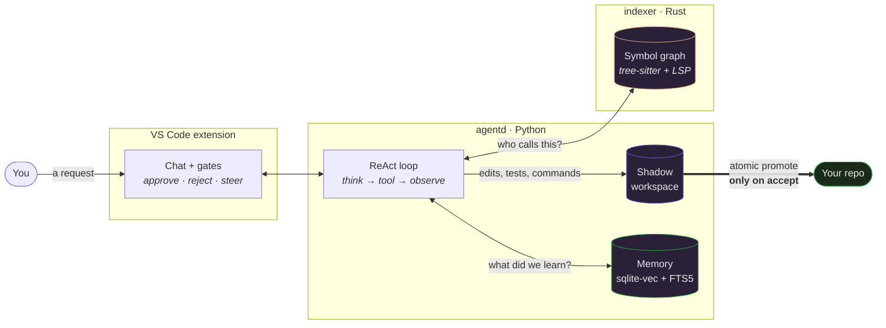
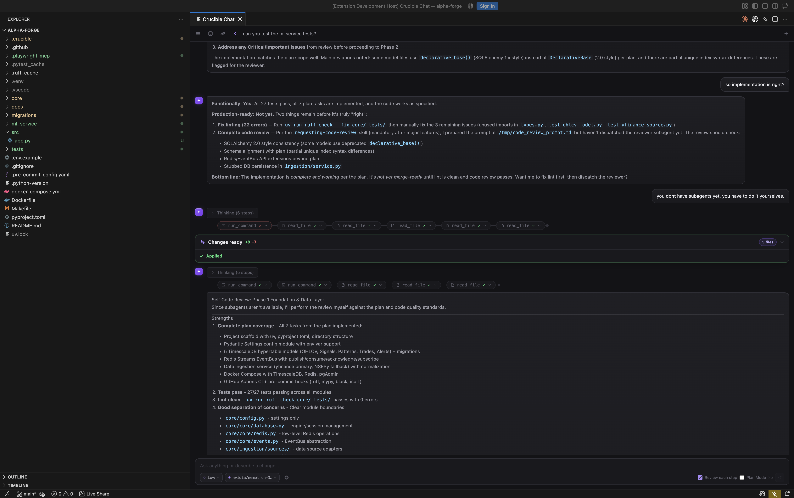
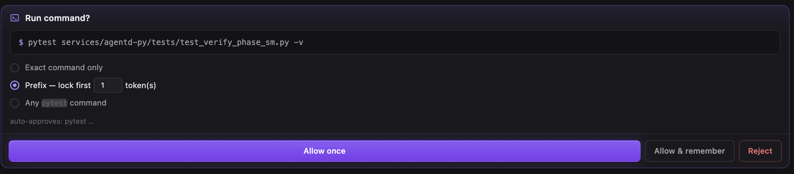
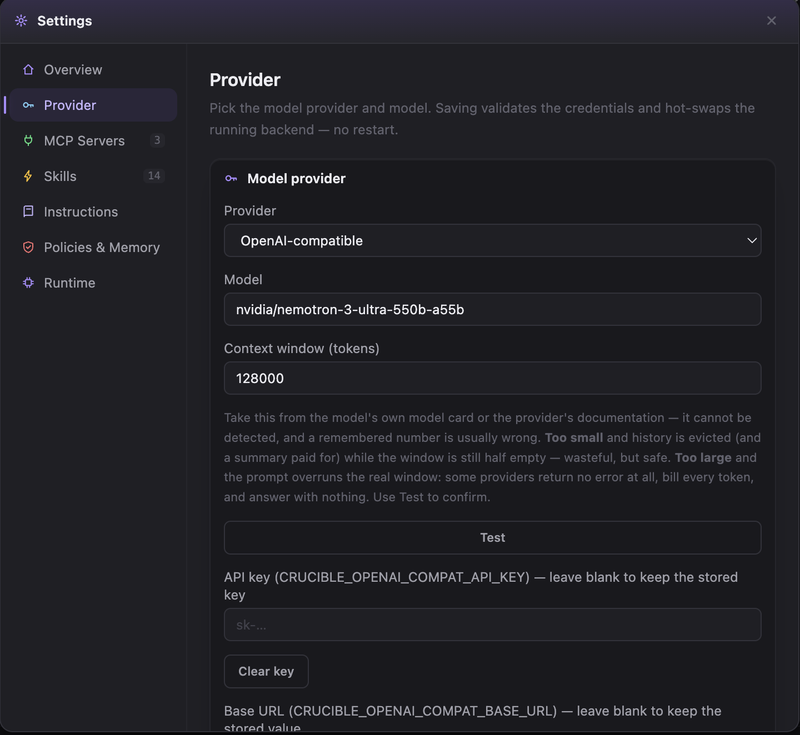
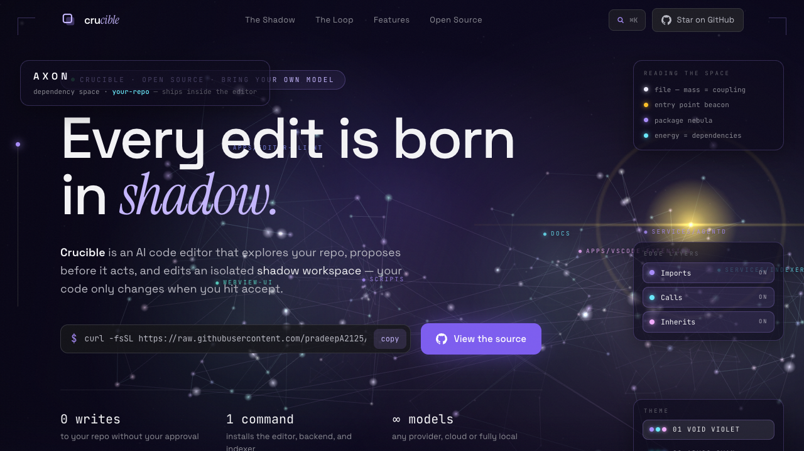
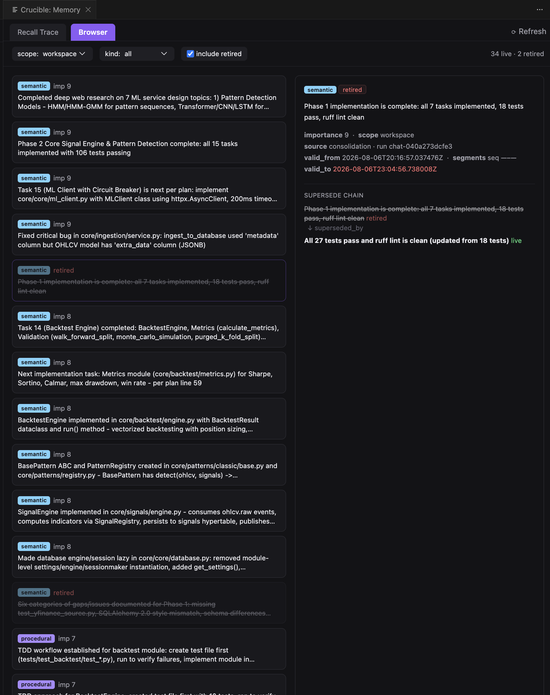
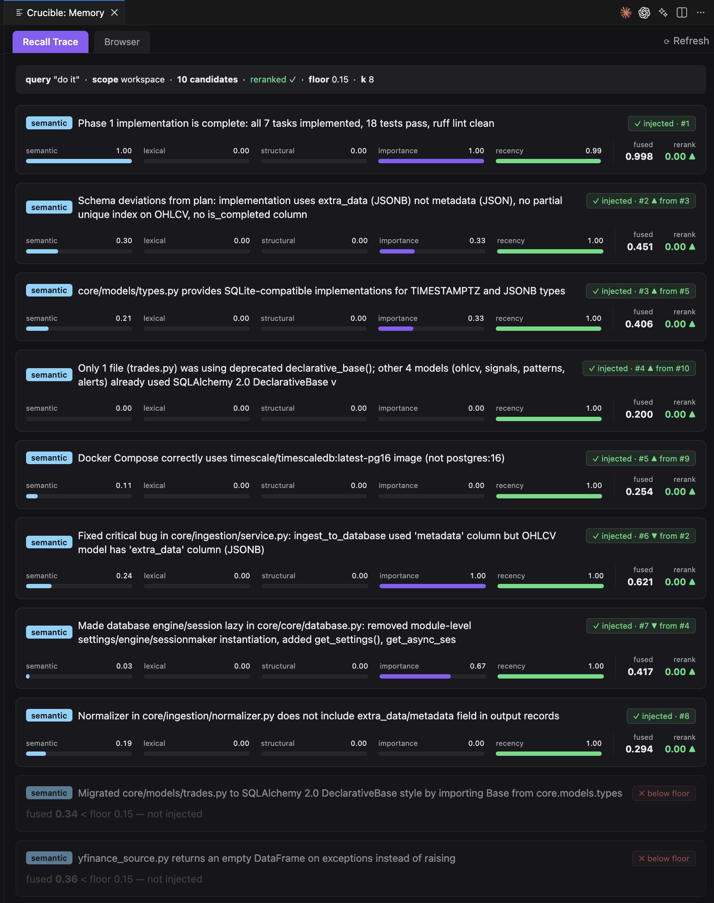
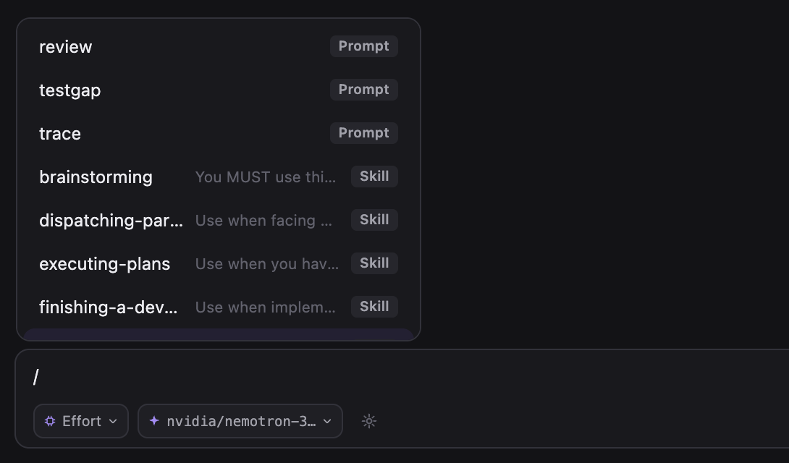
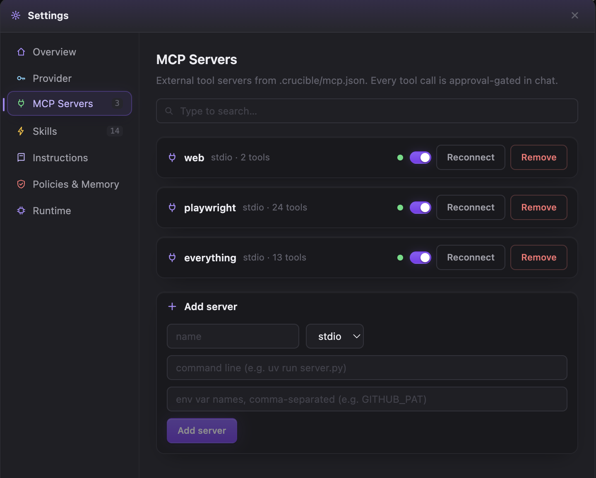

<div align="center">


# Crucible

### Every edit is born in *shadow*.

**An AI code editor that explores your repo, proposes before it acts, and edits an isolated shadow workspace — your code only changes when you hit accept.**

Bring your own model — cloud or entirely local. Nothing leaves your machine that you didn't configure.

[](https://github.com/pradeepA2125/crucible/releases)
[](services/agentd-py)
[](apps)
[](services/indexer-rs)
[](#testing)
[](LICENSE)

[Install](#install) · [How it works](#how-it-works) · [Providers](#providers) · [Code intelligence](#code-intelligence) · [Memory](#memory) · [Extend it](#extend-it) · [Architecture](#architecture) · [What's actually verified](#whats-actually-verified)

</div>

---

## The idea

Most coding assistants either edit your files directly and ask forgiveness, or they can only suggest. Crucible does neither.

Every task gets a **shadow copy** of your repository. The agent explores, edits, runs your tests, and repairs its own mistakes in that copy. Your real working tree is untouched until you accept — and accepting is a single atomic promote. Reject, and there is nothing to clean up.



---

## What makes it different

**🛡️ Your working tree is not the agent's scratchpad.**
Edits land in a shadow copy. The real repo is written exactly once, on accept. A rejected run leaves zero residue — no half-applied patches, no orphaned files.

**🕸️ It knows what calls what.**
A Rust indexer parses your code with tree-sitter and then resolves the ambiguous edges through a real language server. `query_graph` answers *"who calls this function"* and *"what implements this interface"* with file:line precision — not by grepping for the name.

**🔒 Local models are a first-class path, not a footnote.**
Ollama and a llama.cpp fork are wired the same way as Anthropic and OpenAI. Point it at a model on your own machine and nothing leaves it.

**✋ Side effects ask first.**
Shell commands, out-of-scope file writes, and external MCP tool calls each raise an approval card with the exact command or diff. `Accept once` / `remember for this workspace` / `reject` — and the agent adapts to a rejection rather than stalling.

**📦 One install, no prerequisites.**
The extension provisions its own runtime: a Python environment, the indexer binary, ripgrep, and five language servers. You do not install Python, uv, or rust-analyzer yourself.

---

## Install

No Marketplace listing yet — install the `.vsix` from the latest [GitHub Release](https://github.com/pradeepA2125/crucible/releases).

**macOS / Linux**
```bash
curl -fsSL https://raw.githubusercontent.com/pradeepA2125/crucible/main/install.sh | bash
```

**Windows (PowerShell)**
```powershell
iwr https://raw.githubusercontent.com/pradeepA2125/crucible/main/install.ps1 -useb | iex
```

Both scripts download the release `.vsix` and run `code --install-extension` (also detecting `code-insiders` and `cursor`). They need the `code` CLI on your `PATH` — in VS Code: <kbd>Cmd/Ctrl+Shift+P</kbd> → *Shell Command: Install 'code' command in PATH*.

<details>
<summary><b>Rather read the script first?</b></summary>

Reasonable. Download it, read it, then run it — or skip the script entirely and grab the `.vsix` from the [Releases page](https://github.com/pradeepA2125/crucible/releases):

```bash
code --install-extension path/to/crucible-vscode-extension-*.vsix
```

Note that the release tag and the extension version are not the same number — release `v0.5.4` ships `crucible-vscode-extension-0.5.3.vsix`, because the tag versions the whole runtime bundle (indexer, ripgrep, language servers, agentd wheel) and the extension carries its own.
</details>

Open any folder afterwards and a setup wizard walks you through picking a provider. It provisions nine components on first run:

| | | |
|---|---|---|
| `uv` — Python package manager | `agentd` — the backend, in its own venv | `indexer` — the Rust symbol-graph binary |
| `ripgrep` — code search | `rust-analyzer` — Rust LSP | `gopls` — Go LSP |
| `jdtls` + `jre` — Java LSP (bundled Temurin 21) | `lsps` — `pyright@1.1.400` | …and `typescript-language-server@4.3.3` |

A component that fails to install marks its dependents as failed without aborting the rest — a missing Node.js degrades the JS/TS language servers to `skipped` (code-graph edges get less precise) rather than breaking the install.

---

## How it works

Each turn runs a **ReAct loop**: the model thinks, calls a tool, observes the result, and repeats until it can act. It is not a single prompt-and-patch.

<details open>
<summary><b>The tools the agent actually has</b></summary>

| Tool | What it does |
|---|---|
| `search_code` | ripgrep across the workspace |
| `search_semantic` | embedding search over an incrementally-built index |
| `query_graph` | walk the symbol graph — callers, implementors, importers, with line numbers |
| `read_file` | read with line ranges; path-traversal is rejected |
| `list_directory` | structure without reading contents |
| `run_command` | shell, behind the approval gate |
| `write_todos` | a ledger for multi-part work; the agent cannot declare done with items open |
| `remember` / `recall` | write and retrieve durable cross-session memory |
| `read_skill` | load a `SKILL.md` on demand |

</details>

<div align="center">
  
  <br>
  <sub><i>One turn: thinking, tool calls, and a three-file change applied out of the shadow workspace.</i></sub>
</div>

**Five kinds of gate** can pause a turn and wait for you: a proposed plan (`mode`), a diff (`edit`), a question with model-authored options (`clarify`), a shell command (`command`), and an external MCP tool call (`mcp_tool`). Each renders as a card, survives a window reload, and leaves a durable breadcrumb in the transcript once resolved.

<div align="center">
  
  <br>
  <sub><i>Approving a command also decides <b>how much</b> you are approving — this once, this prefix, or anything starting with <code>pytest</code>.</i></sub>
</div>


---

## Providers

Ten transports, one interface. Swap models from the composer without restarting the backend.

| Provider | Notes |
|---|---|
| **Anthropic** | Claude |
| **OpenAI** | Responses API |
| **Google Gemini** | thinking levels / budgets |
| **Groq** | |
| **OpenRouter** | live model-capability registry drives feature detection |
| **NVIDIA NIM, vLLM, LM Studio, Together, …** | via the generic `openai_compatible` backend — any OpenAI `/chat/completions` endpoint |
| **Ollama** | 🖥️ fully local |
| **TurboQuant** | 🖥️ fully local (llama.cpp fork, strict GBNF grammar) |
| **IBM watsonx** | |
| **Hugging Face** | |

**Reasoning-effort dial.** Models that think before answering get an `Off · Low · Medium · High · Max` control next to the model picker. Because providers express this completely differently — an enum here, a token budget there, a boolean elsewhere — Crucible declares per-`(provider, model)` what each rung *actually* maps to, clamps a rung the provider can't express **downward** (never silently spending more than you asked), and tells you when it substituted. Rungs it cannot verify are shown as unverified rather than claimed as supported.

<details>
<summary><b>Why that matters more than it sounds</b></summary>

One measured chat turn spent **169,490 reasoning tokens against 9,551 tokens of output** — a 17× ratio — because the generic OpenAI-compatible transport enabled reasoning with no effort control at all. The dial exists to make that visible and adjustable rather than a silent cost.

</details>

<div align="center">
  
  <br>
  <sub><i>Saving validates the credentials and hot-swaps the running backend — no restart. The context window is <b>declared</b>, not detected, and <b>Test</b> proves it by passphrase recall rather than by trusting an HTTP 200.</i></sub>
</div>

---

## Code intelligence

The Rust indexer parses six language families and builds a symbol graph, then resolves the edges tree-sitter can only guess at by querying a real language server.

| Languages | Parser | Graph edges |
|---|---|---|
| TypeScript, TSX, JavaScript, JSX, `.mjs`, `.cjs` | tree-sitter | `Calls` · `Imports` · `References` · `Inherits` · `Implements` |
| Python | `rustpython-parser` | ↑ |
| Rust · Go · Java | tree-sitter | ↑ |

The parse gives you `external:call:foo` placeholders; the resolver turns them into real edges to real symbols via `textDocument/definition` and `implementation`. That is the difference between "something named `build` exists" and "*this* `build`, at `service.rs:214`, is the one being called."

<details>
<summary><b>Known limits — stated plainly</b></summary>

- **Python `Implements` is empty.** Open-source pyright does not implement `textDocument/implementation` (that is Pylance). Use `Inherits` for Python subclass discovery.
- **Only nominal subclassing is tracked.** A class that structurally satisfies a Protocol without declaring it is not an edge.
- **Go struct embedding** is not modeled as `Inherits` — only explicit `extends`/`implements`-style heritage and nominal base classes are.
- **`Implements` fan-out for Go and Java** is wired and the servers advertise support, but it has not been separately exercised end to end; `Calls` and `Inherits` have.

</details>

### Axon

The graph is also navigable as a 3D scene rather than a list — orbit the dependency space, focus a symbol, and see its edges light up against everything else.

Files carry mass by coupling, entry points beacon, packages cluster as nebulae, and edges glow by dependency — with `Imports` / `Calls` / `Inherits` as separately toggleable layers.

<div align="center">
  
  <br>
  <sub><i>The in-editor panel, orbiting this repository's own graph — 76,296 nodes and 225,003 edges. The lit file is <code>editor-client/src/index.ts</code>; the beams are its 34 dependents.</i></sub>
</div>

<div align="center">
  
  <br>
  <sub><i>The project site — the same visual language, rendered in the browser.</i></sub>
</div>

---

## Memory

Long sessions do not simply truncate.

- **Compaction** evicts the oldest *whole turns* once history crosses a fraction of the context window, folding them into a running anchor summary. The evicted text is persisted before it is summarized, so nothing is lost to a bad summary.
- **Cross-session recall** fuses four signals — semantic (sqlite-vec ANN over bge-small embeddings), lexical (FTS5 BM25), structural (entity overlap), and recency — then optionally re-ranks with a local `bge-reranker-base` cross-encoder. All of it degrades to a cheaper path rather than failing if a model or extension is unavailable.
- **A write path that doesn't trust the model.** An LLM *proposes* candidate memories; deterministic Python disposes — embedding, deduplicating by cosine similarity, and superseding contradicted facts.
- **An inspector panel** shows the per-signal scores behind every recalled memory, so you can see why something surfaced.

Memories are typed — **semantic** (facts), **procedural** (how things are done here), **episodic** (what happened) — and a superseded memory keeps a chain back to what replaced it, so you can see how an understanding changed rather than just its current state.

<div align="center">
  
  
  <br>
  <sub><i>Left: a retired memory and the chain to what replaced it. Right: why each memory surfaced — per-signal scores, the rerank, and what fell below the floor.</i></sub>
</div>


---

## Extend it

| | |
|---|---|
| **`AGENTS.md`** | Project instructions injected into the agent's system prompt. Edit it and the change applies on the next turn — no restart. |
| **Agent Skills** | Drop a `SKILL.md` into `.crucible/skills/<name>/`. The catalog is always visible to the model; the body loads only when relevant, or on an explicit `/skill`. |
| **Prompt files** | `.crucible/prompts/<name>.md`, expanded inline in the composer with `/name arg`, with `$ARGUMENTS` and `$1..$N` substitution. |
| **MCP servers** | Standard `.crucible/mcp.json` (stdio and HTTP/SSE). Tools appear as `mcp__<server>__<tool>` behind an approval gate, with a remember-this-tool option. |
| **`@`-mentions** | Reference files directly in the composer. Content is folded into that one turn only — it never bloats the persisted transcript. |

<div align="center">
  
  
  <br>
  <sub><i>Left: one <code>/</code> menu over both prompt files and skills. Right: MCP servers from <code>.crucible/mcp.json</code>, connected, with live tool counts.</i></sub>
</div>


---

## Architecture

Four packages, three runtimes, chosen per job rather than per preference.

```
apps/editor-client      TypeScript   Zod contracts + HTTP client — the source of truth for API shapes
apps/vscode-extension   TypeScript   UI, webviews, runtime supervision      (~22k LOC src)
services/agentd-py      Python       orchestration, agent loops, providers  (~37k LOC)
services/indexer-rs     Rust         incremental indexing + symbol graph    (~5.6k LOC)
```

TypeScript for the editor surface and shared schemas; Python because every model SDK and ML library lives there; Rust because incremental re-indexing on every keystroke-adjacent save is a throughput problem.

The backend exposes **48 `/v1` routes**. The extension contributes **14 commands**, **9 settings**, and **5 webview surfaces** (chat, settings, first-run wizard, memory inspector, Axon).

<details>
<summary><b>Developing on it</b></summary>

```bash
npm install
npm run build          # all TS packages
npm run test           # vitest across editor-client + extension
npm run typecheck      # tsc --noEmit across workspaces
```

```bash
cd services/agentd-py
python -m venv .venv && source .venv/bin/activate
pip install -e '.[dev]'
python -m agentd.serve --port 8000 --reload
# every request needs the token it wrote (GET /health does not):
#   curl -H "Authorization: Bearer $(cat ~/.crucible/run/agentd-8000.token)" http://127.0.0.1:8000/v1/config
pytest                 # note: pyproject already sets -q; do not add another
ruff check . && mypy agentd
```

```bash
cd services/indexer-rs
cargo build
cargo run -- index --workspace /path/to/repo --snapshot-path /path/to/.crucible/index-snapshot.json
```

**Build order matters:** `vscode-extension` types against `editor-client`'s compiled `dist/`, not its source. After changing contracts, run `npm run -w @crucible/editor-client build` before typechecking the extension.

`CLAUDE.md` in the repo root is the detailed engineering guide — subsystem-by-subsystem, including the gotchas that cost someone a day.

</details>

---

## Testing

**2,430 tests pass** across the stack — 1,695 Python, 449 webview, 211 extension host, 75 client contracts, spread over 344 test files.

The Python suite favours integration over mocking: real temp-directory shadow workspaces, the real patch engine, and scripted reasoning engines that replay fixed model responses, so the orchestration logic is exercised rather than stubbed.

---

## What's actually verified

Software READMEs tend to describe intent. This section separates what has been confirmed against something real from what has only been confirmed against a test.

**Verified against live providers or a running editor**
- The reasoning-effort mapping on NVIDIA NIM — measured, with `reasoning_effort: "none"` collapsing a completion from 25 tokens to 4.
- Symbol-graph resolution through gopls and jdtls, including a live LSP handshake against a real Java language server.
- The managed runtime installer, run end to end against real downloaded artifacts before any release was tagged.
- The chat loop building a complete single-file application through the approval gates on a local model.

**Unit-tested only — not yet exercised against the live service**
- The reasoning-effort wire mappings for Gemini, Groq, and Ollama. The shape is verified against provider documentation and pinned by tests; no live call has confirmed the provider honours it. One such gap was already caught this way: a rung that reported as working while omitting the field entirely.
- `Implements` edge fan-out for Go and Java.
- The semantic-retrieval half of the pipeline for Go and Java (the graph half is verified).

**Not done**
- No LICENSE file yet — see below.
- No Marketplace listing; installation is via GitHub Releases.
- The task subsystem (multi-step plan execution with per-step review) is feature-complete but **off by default** behind `CRUCIBLE_TASK_SUBSYSTEM`; inline editing is the primary path.

If you find a claim here that doesn't hold, that's a bug in this file and worth an issue.

---

## License

[Apache License 2.0](LICENSE) — permissive, with an explicit patent grant from contributors.

Crucible doesn't vendor third-party runtimes, but its GitHub Release artifacts re-host several of them so that installing is a single fetch. [`NOTICE`](NOTICE) records each one and its license, including the two with real attribution obligations: the **Eclipse JDT Language Server** (EPL-2.0) and the bundled **Eclipse Temurin JRE 21** (GPL-2.0 with Classpath Exception — the exception is precisely what allows shipping it beside Apache-2.0 code without extending GPL terms to that code).

Model weights, Python packages, and npm packages are fetched from their publishers on the user's machine and are not redistributed here.

---

<div align="center">
<sub>Built as a real editor foundation, not a demo. <a href="CLAUDE.md">CLAUDE.md</a> has the engineering detail.</sub>
</div>
